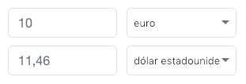

# Money Converter Web

## Goal
- Implement a web to make conversions 

## User Stories to implement
#### World money converter
    As a person with a budget in euros that wants to exchange to another currenty
    I want to know how much money I will get
    so I can ensure the exchange house gives me a fair amount 

#### Suggested presentation

#### Suggested user experience

Play with what [Google offers](https://www.google.com/search?q=10+euro+to+usd)

#### Don't Repeat Yourself
    As a Technical lead
    I want have no duplicated code depending on how we access to the application (web or console)
    so we don't have to mantain the code twice.

## Author
[Luis Rovirosa](https://twitter.com/luisrovirosa)
